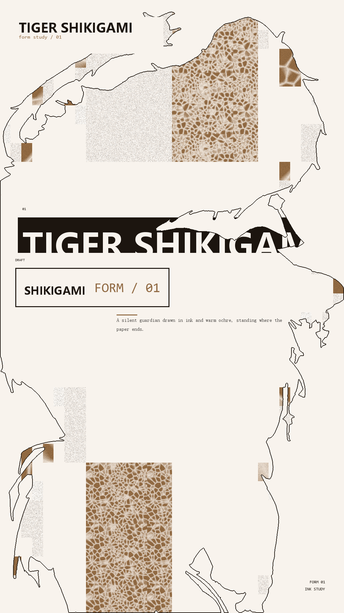
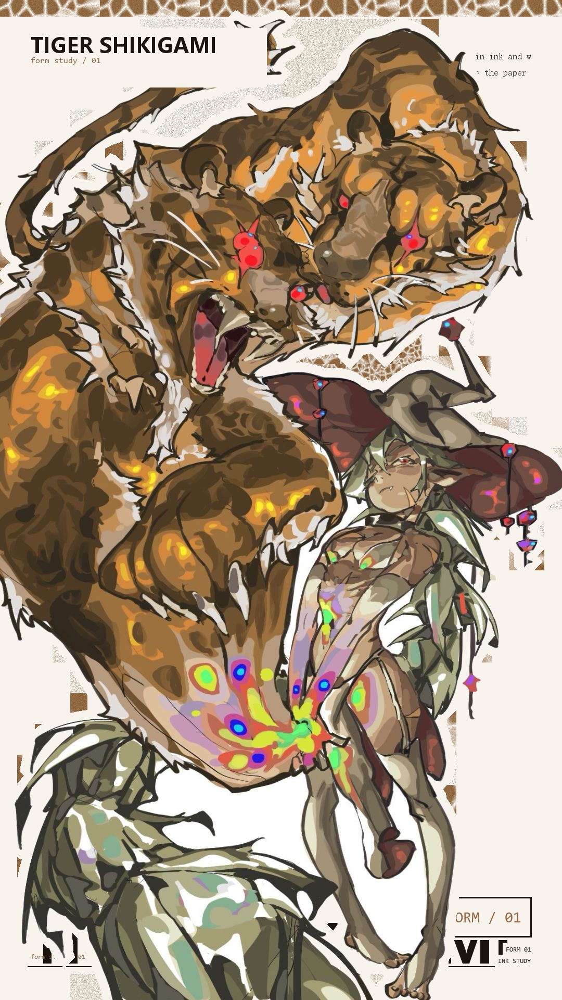
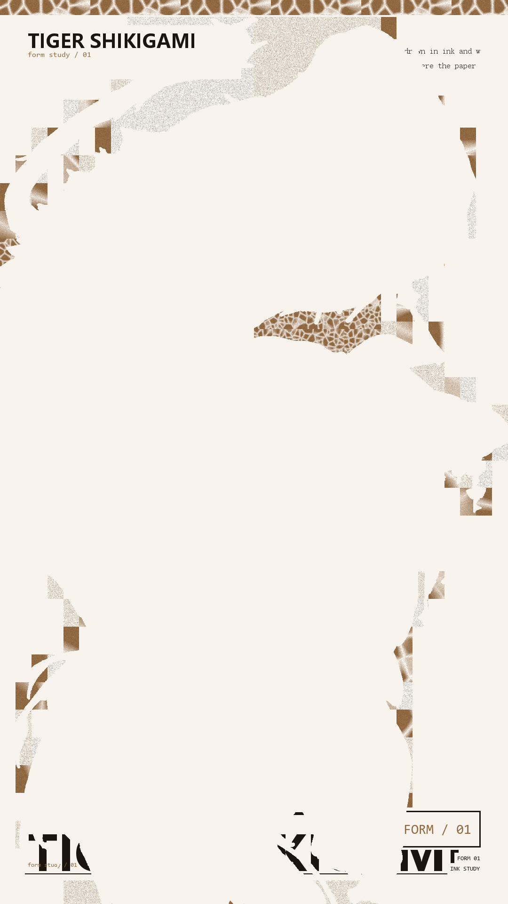

# collage

把文字与图形组件拼贴进任意形状的排版引擎。

输入一张图（人物剪影、物件轮廓）加一段文字，输出一张海报：文字被排进 **形状内部**，构成那个形状本身。

```
输入                        输出
  ┌────────┐                ┌────────┐
  │  剪影  │  + 「虎式神」 →  │▉▉ 标题 │   形状由文字和图形组件
  │        │                │▉ 拼贴  │   拼出来 —— 远看是剪影，
  └────────┘                └────────┘   近看是内容
```

## 它解决什么问题

常见的「文字排成形状」做法是把字逐行填进形状——沿着扫描线摆字，字挤满就换行。

这样做出来的图**没有视觉层级**：所有字差不多大，远看是一块均匀的灰色。近看也读不出主次，因为一级标题和正文的差别只剩一两个字号。

这个项目换了个做法：**先切块，再摆组件**。

1. 把形状的包围盒递归四等分（四叉树），得到一组大小错落的矩形 —— 也就是设计里的「不平均网格」
2. 按 **3:1:1:9** 的面积比把矩形分配给主标题 / 副标题 / 正文 / 无意义四个层级
3. 每个层级实例化成不同的组件形态：巨型反白字块、描边方框、报栏正文、质感底纹
4. 组件允许超出形状边界、被形状裁切 —— 这是「极端字号」的落地方式

层级来自**差异**（字号跨度、组件形态、面积对比），不来自统一放大。

## 效果







## 三种呈现范式

同一套排版层，区别只在它和形状的关系：

| 范式 | 说明 | 排版层位置 |
|---|---|---|
| `silhouette` 剪影填充 | 排版构成形状 | 版心在形状内 |
| `photo` 原图加背景 | 原图贴上去，排版当背景 | 版式贴画布边缘 |
| `negative` 背景负形 | 形状以留白出现 | 版式贴画布边缘 |

范式二和三**必须**用贴边版式 —— 用版心版式会被剪影整个挖掉，只剩碎片。

## 用法

```bash
pip install -e .

collage examples/tiger-shikigami.jpg \
  --title "TIGER SHIKIGAMI" \
  --title-sub "original artwork / form 01" \
  --sub "SHIKIGAMI" --sub-en "FORM / 01" \
  --body "A silent guardian drawn in ink and warm ochre." \
  --out out/
```

或者不安装，直接跑：

```bash
python -m collage examples/tiger-shikigami.jpg --title "TIGER SHIKIGAMI"
```

输出到 `out/`：

```
out/剪影填充.png
out/原图加背景.png
out/背景负形.png
```

常用选项：

```
--threshold 242     白底阈值（背景偏灰时调高）
--largest-only      只保留最大连通域（素材是单一主体时更快）
--paradigm photo    只出一种范式
--tags 01,2026,A    散落的小标签
--meta "FORM 01"    右下角元信息（可重复传）
```

## 配色是采样出来的，不是写死的

`theme_from_image()` 从原图**主体区域**取色，派生整套配色（强调色 / 墨色 / 纸色 / 底纹基色）。

所以换一张素材，配色自动跟着变，代码不用动：

| 素材 | 采样主色 | 结果 |
|---|---|---|
| 暖黄卡通形象 | `(236, 192, 89)` | 亮金 + 暖白纸 |
| 棕橙插画 | `(176, 131, 86)` | 沉棕橙 + 暖白纸 |

选主色时按 **饱和度 × 明度^2.2** 打分，而不是只看饱和度 —— 只看饱和度会被深色轮廓和暗部拉偏（实测会选出深棕而非亮黄）。

## 算法

```
① 形状提取   shape.load_mask()
             白底 / 透明 PNG 两路自动选择 → 二值化 → 填孔 →
             连通域去噪（默认保留所有主连通域，素材常含多个分离主体）

② 分区       partition.quadtree()
             递归四等分；接受阈值在 0.62–0.88 之间随机 →
             块面积天然错落，避免大量等大块

③ 分层       partition.assign_levels()
             按 3:1:1:9 把矩形分给四层；主标题优先落在「厚」处
             （距边缘远的地方，避免大字卡在细枝末节里）

④ 组件       layout.build_layout()
             尺寸由【面积比 × 形状面积】反推，不是拍脑袋定的比例；
             文字撑满组件（字号由组件尺寸反算）

⑤ 质感       texture.tile()
             磨砂 / 细胞噪声 / 纯色；只覆盖部分块，其余留纸色

⑥ 渲染       render.render()
             三种范式 + 信息层
```

两个性能要点：

- **细胞噪声按小样平铺**：直接在 1080×1920 上算 Worley 会爆内存（26 个点 × 整块像素的数组）。改成先在 192px 小样上算一次再平铺，从「跑不完」到 22 秒。
- **字号对象缓存**：逐帧渲染场景下，每次 `truetype()` 都是磁盘 IO。

## 依赖

```
numpy>=1.24    pillow>=10.0    scipy>=1.10
```

字体走系统路径（Windows 默认雅黑 / 宋体 / Consolas）；其他平台改 `LayoutSpec` 里的字体字段。

## 不做什么

明确划出去，省得你试了才知道：

- **不做自动抠图**。只认白底图和带透明通道的 PNG。复杂背景请先用别的工具抠好。
- **不做文字绕排**。文字不会沿着曲线排布，也不会为图形让路 —— 组件是矩形，形状负责裁切。
- **不保证 100% 落在形状内**。这是刻意的：允许出血和裁切，形状可辨识就行。
- **不做字体子集化和嵌入**。用的是系统字体，成图是位图不是矢量。
- **只支持横排**。没有竖排、没有任意角度旋转。

## 状态

0.1.0，接口还会变。已知的粗糙处：

- 底纹块是均匀的矩形，边界明显，远看像「贴纸」
- 轮廓线固定 2px，缩到手机屏会看不清
- 形状提取靠阈值，浅色主体（本身接近白）会抠不干净

## 给 agent 用

仓库自带 `SKILL.md` —— 这是给 AI agent 的操作接口（安装路径、参数含义、设计参数在哪调、排查表）。

装到各家 agent：

```bash
# Hermes Agent
cp -r SKILL.md ~/AppData/Local/hermes/skills/creative/collage/

# Claude Code
mkdir -p .claude/skills/collage && cp SKILL.md .claude/skills/collage/

# dsh (DeepSeek Harness) —— frontmatter 只认 name + description
mkdir -p ~/.dsh/skills/collage && cp SKILL.md ~/.dsh/skills/collage/
```

装上之后 agent 才知道：**这个项目存在、能干什么、怎么调、出错往哪查**。没有它，agent 发现不了这个仓库。

> 为什么单独需要这份文件：README 是给**人**的送达路径，agent 不看 README，它看 skill catalog。

## 许可

MIT
